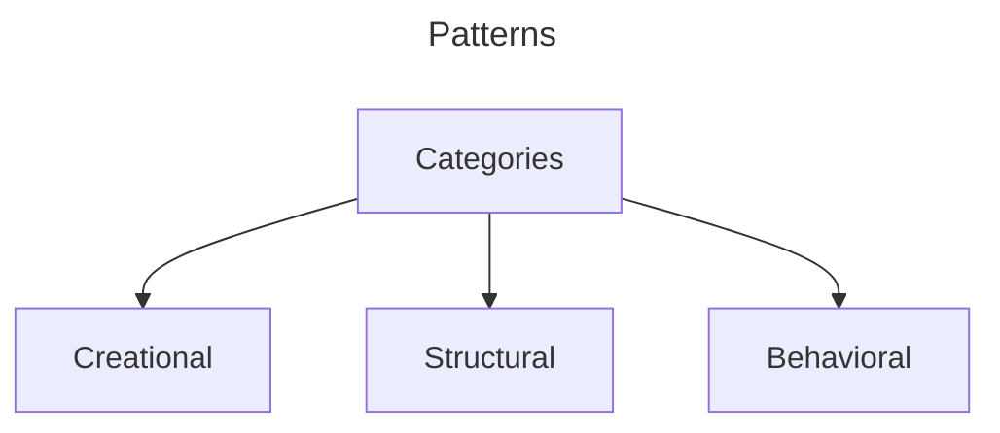
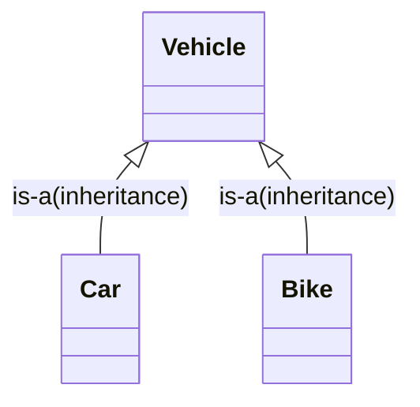
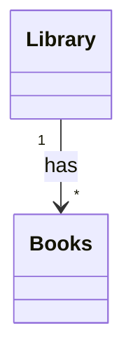
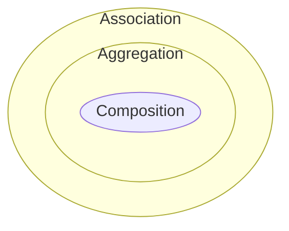
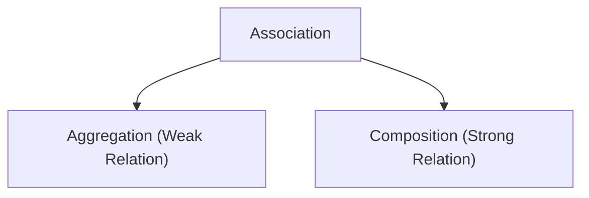
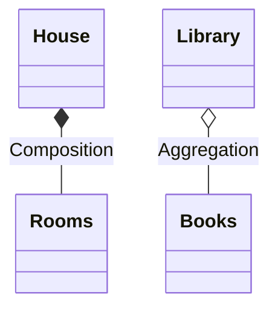

# Categories of Patterns



---

# Creational

- Controls Object Creation

## Types

- Singleton
- Builder
- Factory
- Abstract Factory
- Object Pool
- Prototype

# Structural

- Focus on, how different classes and objects are **arranged** together to solve a bigger problem
- Provides skeleton

### Example

- To build a car, we have multiple classes
  - Wheel
  - Steering
  - Engine
- How these classes or arranged to build the car

### Types

- Decorator
- Proxy
- Composite
- Adapter
- Facade
- Bridge
- Flyweight

# Behavioral

- Focus on, How different classes **interact** with each other
- Provides interaction, co-ordination and responsibility of the skeleton

### Types

- State
- Strategy
- Observer
- Chain Of Responsibility
- Template
- Iterator
- Interpreter
- Command
- Visitor
- Mediator
- Memento
- Null Object

---

# Has-a and Is-a relationship

> is-a is nothing but **inheritance**



> Has-a shows link between two objects

> Has-a is an Association relationship







| Condition | Aggregation                                                       | Composition                                                                      |
| --------- | ----------------------------------------------------------------- | -------------------------------------------------------------------------------- |
| Existence | Existence of one object is not dependent on other                 | Existance of one object is dependent on other                                    |
| Example   | Library has Books                                                 | House has Rooms                                                                  |
| Logic     | Library can exists without books. Book can exists without Library | Rooms existence depends upon House. If House is destroyed, rooms does not exists |

## Representation



```java
class Library{
    List<Books> books;
    // Does not take care of creation and managing of books
}
```

```java
class House{
    List<Rooms> rooms;
    // Need to take care of creation and management of Rooms
    House(){
        rooms = new ArrayList<>();
        rooms.add(new Room("Living Room"));
        rooms.add(new Room("Bedroom"))
    }
}
```

# SOLID Principle

- Single Responsibility
- Open Closed Principle
- Liskov Substitution Principle
- Interface Segregation Principle
- Dependency Injection Principle

## Single Responsibility

> **A Class should have only once reason to change**, means a class should have one and only job or responsibility

### Violation

```java
public class Marker {
    String name;
    String color;
    int price;
    int year;

    public Marker(String name, String color, int price, int year) {
        this.name = name;
        this.color = color;
        this.price = price;
        this.year = year;
    }
}
```

```java
// BAD: This class violates SRP by having multiple responsibilities
public class Invoice {
    private Marker marker;
    private int quantity;
    private int total;

    public Invoice(Marker marker, int quantity) {
        this.marker = marker;
        this.quantity = quantity;
    }

    // Responsibility 1: Calculate the total(business logic)
    public void calculateTotal() {
        System.out.println("Calculating total...");
        this.total = this.marker.price * this.quantity;
    }

    // Responsibility 2: Print the Invoice
    public void printInvoice() {
        // print the Invoice
        System.out.println("Printing Invoice...");
    }

    // Responsibility 3: Database Operations
    public void saveToDB() {
        // Save the data into DB
        System.out.println("Saving to DB...");
    }
}
```

```java
public class Demo {
    public static void main(String[] args) {
        Invoice invoice = new Invoice(new Marker("name", "color", 10, 2020), 10);
        invoice.calculateTotal();
        invoice.saveToDB();
        invoice.printInvoice();
    }
}
```

**Problems with above code**

- `Invoice` class has 3 responsibilities
  - Calculate Total
  - Print Invoice
  - Store Invoice to DB
- It violates Single Responsibility because
  - If tax calculation changes, `Invoice` class has to change
  - If Database structure changes, `Invoice` class has to change
  - If printing requirement changes, `Invoice` class has to change

### Solution

Invoice.java

```java
// Responsibility: Managing Invoice data only
public class Invoice {

    private Marker marker;
    private int quantity;
    private int total;

    public Invoice(Marker marker, int quantity) {
        this.marker = marker;
        this.quantity = quantity;
    }

    // Responsibility 1: Calculate the total(business logic)
    public void calculateTotal() {
        System.out.println("Calculating total...");
        this.total = this.marker.price * this.quantity;
    }
}
```

InvoiceDao.java

```java
// Responsibility 2: Managing Database Operations only
public class InvoiceDao {

    Invoice invoice;

    public InvoiceDao(Invoice invoice) {
        this.invoice = invoice;
    }

    public void saveToDB() {
        // Save into the DB the invoice
        System.out.println("Saving to DB...");
    }
}
```

InvoicePrinter.java

```java
// Responsibility 3: Printing the Invoice only
public class InvoicePrinter {

    private Invoice invoice;

    public InvoicePrinter(Invoice invoice) {
        this.invoice = invoice;
    }

    public void print() {
        // print the invoice
        System.out.println("Printing Invoice...");
    }
}
```

**Key Benifits**

- All classes have single responsibility
- Better Maintainability
- Better testing
- Enhanced Reusability
