# Categories of Patterns

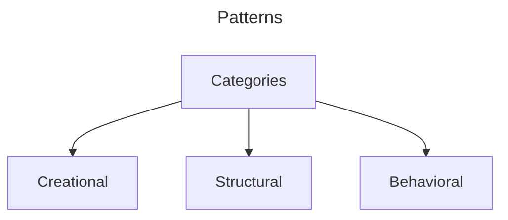

---

# Creational

- Controls Object Creation

## Types

- Singleton
- Builder
- Factory
- Abstract Factory
- Object Pool
- Prototype

# Structural

- Focus on, how different classes and objects are **arranged** together to solve a bigger problem
- Provides skeleton

## Example

- To build a car, we have multiple classes
  - Wheel
  - Steering
  - Engine
- How these classes or arranged to build the car

## Types

- Decorator
- Proxy
- Composite
- Adapter
- Facade
- Bridge
- Flyweight

# Behavioral

- Focus on, How different classes **interact** with each other
- Provides interaction, co-ordination and responsibility of the skeleton

## Types

- State
- Strategy
- Observer
- Chain Of Responsibility
- Template
- Iterator
- Interpreter
- Command
- Visitor
- Mediator
- Memento
- Null Object

---

# Has-a and Is-a relationship

> is-a is nothing but **inheritance**

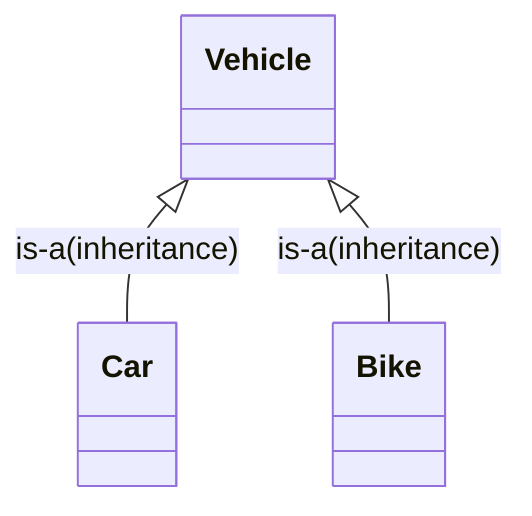

> Has-a shows link between two objects

> Has-a is an Association relationship

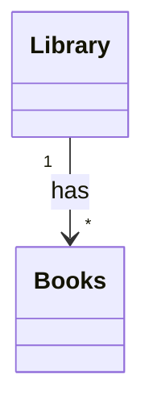

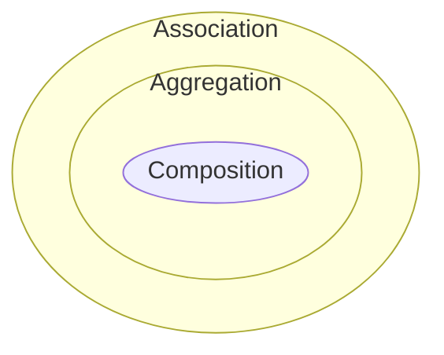

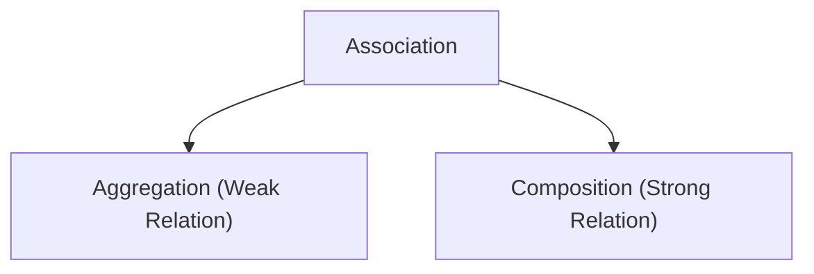

| Condition | Aggregation                                                       | Composition                                                                      |
| --------- | ----------------------------------------------------------------- | -------------------------------------------------------------------------------- |
| Existence | Existence of one object is not dependent on other                 | Existance of one object is dependent on other                                    |
| Example   | Library has Books                                                 | House has Rooms                                                                  |
| Logic     | Library can exists without books. Book can exists without Library | Rooms existence depends upon House. If House is destroyed, rooms does not exists |

## Representation

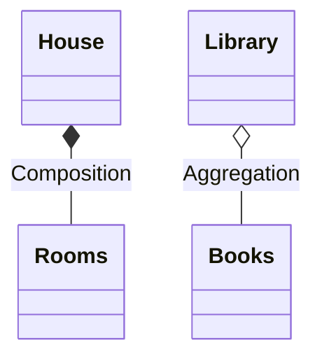

```java
class Library{
    List<Books> books;
    // Does not take care of creation and managing of books
}
```

```java
class House{
    List<Rooms> rooms;
    // Need to take care of creation and management of Rooms
    House(){
        rooms = new ArrayList<>();
        rooms.add(new Room("Living Room"));
        rooms.add(new Room("Bedroom"))
    }
}
```

# SOLID Principle

- Single Responsibility
- Open Closed Principle
- Liskov Substitution Principle
- Interface Segregation Principle
- Dependency Injection Principle

## Single Responsibility

> **A Class should have only once reason to change**, means a class should have one and only job or responsibility

### Violation

```java
public class Marker {
    String name;
    String color;
    int price;
    int year;

    public Marker(String name, String color, int price, int year) {
        this.name = name;
        this.color = color;
        this.price = price;
        this.year = year;
    }
}
```

```java
// BAD: This class violates SRP by having multiple responsibilities
public class Invoice {
    private Marker marker;
    private int quantity;
    private int total;

    public Invoice(Marker marker, int quantity) {
        this.marker = marker;
        this.quantity = quantity;
    }

    // Responsibility 1: Calculate the total(business logic)
    public void calculateTotal() {
        System.out.println("Calculating total...");
        this.total = this.marker.price * this.quantity;
    }

    // Responsibility 2: Print the Invoice
    public void printInvoice() {
        // print the Invoice
        System.out.println("Printing Invoice...");
    }

    // Responsibility 3: Database Operations
    public void saveToDB() {
        // Save the data into DB
        System.out.println("Saving to DB...");
    }
}
```

```java
public class Demo {
    public static void main(String[] args) {
        Invoice invoice = new Invoice(new Marker("name", "color", 10, 2020), 10);
        invoice.calculateTotal();
        invoice.saveToDB();
        invoice.printInvoice();
    }
}
```

**Problems with above code**

- `Invoice` class has 3 responsibilities
  - Calculate Total
  - Print Invoice
  - Store Invoice to DB
- It violates Single Responsibility because
  - If tax calculation changes, `Invoice` class has to change
  - If Database structure changes, `Invoice` class has to change
  - If printing requirement changes, `Invoice` class has to change

### Solution

Invoice.java

```java
// Responsibility: Managing Invoice data only
public class Invoice {

    private Marker marker;
    private int quantity;
    private int total;

    public Invoice(Marker marker, int quantity) {
        this.marker = marker;
        this.quantity = quantity;
    }

    // Responsibility 1: Calculate the total(business logic)
    public void calculateTotal() {
        System.out.println("Calculating total...");
        this.total = this.marker.price * this.quantity;
    }
}
```

InvoiceDao.java

```java
// Responsibility 2: Managing Database Operations only
public class InvoiceDao {

    Invoice invoice;

    public InvoiceDao(Invoice invoice) {
        this.invoice = invoice;
    }

    public void saveToDB() {
        // Save into the DB the invoice
        System.out.println("Saving to DB...");
    }
}
```

InvoicePrinter.java

```java
// Responsibility 3: Printing the Invoice only
public class InvoicePrinter {

    private Invoice invoice;

    public InvoicePrinter(Invoice invoice) {
        this.invoice = invoice;
    }

    public void print() {
        // print the invoice
        System.out.println("Printing Invoice...");
    }
}
```

**Key Benifits**

- All classes have single responsibility
- Better Maintainability
- Better testing
- Enhanced Reusability

## Open Close Principle

> Class should be open for extension and closed for modification

- Means that new functionality can be added through inheritance rather than modifying the existing code

### Violation

InvoiceDaoOld.java

```java
public class InvoiceDaoOld {

    Invoice invoice;

    public InvoiceDaoOld(Invoice invoice) {
        this.invoice = invoice;
    }

    public void saveToDB() {
        // Save into the DB the invoice
        System.out.println("Saving to DB...");
    }
}
```

InvoiceDao.java

```java
public class InvoiceDao {

    Invoice invoice;

    public InvoiceDao(Invoice invoice) {
        this.invoice = invoice;
    }

    public void saveToDB() {
        // Save into the DB the invoice
        System.out.println("Saving to DB...");
    }

    // BAD: This design violates OCP
    // Every time we add a new save function, we need to modify existing InvoiceDao class
    public void saveToFile() {
        // Save into the file
        System.out.println("Saving to file...");
    }
}
```

**Problems with above code**

- **Modification:** Every time we add a new way to save invoice, we need to modify the `InvoiceDao` class
- **Risk of Breaking Things:** New changes might introduce bugs
- **Testing Issues:** Need to test complete functionality

### Solution

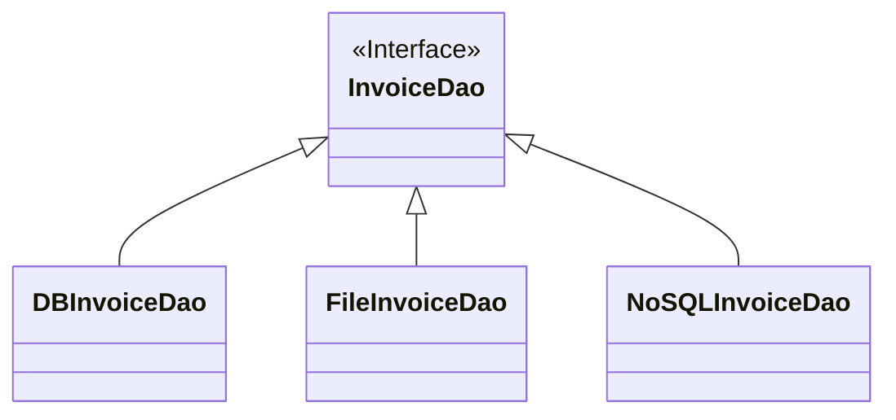

```java
// GOOD: Following OCP using interfaces and polymorphism
public interface InvoiceDao {
    void save();
}
```

FileInvoiceDao.java

```java
// Concrete implementation for FileInvoiceDao
// NEW File Save Operation: An extension without modification!
public class FileInvoiceDao implements InvoiceDao {

    Invoice invoice;

    public FileInvoiceDao(Invoice invoice) {
        // set the invoice
        this.invoice = invoice;
    }

    @Override
    public void save() {
        // Save into the file the invoice
        System.out.println("Saving to file...");
    }
}
```

DatabaseInvoiceDao.java

```java
// Concrete implementation for DatabaseInvoiceDao
public class DatabaseInvoiceDao implements InvoiceDao {
    Invoice invoice;

    public DatabaseInvoiceDao(Invoice invoice) {
        // set the invoice
        this.invoice = invoice;
    }

    @Override
    public void save() {
        // Save into the DB the invoice
        System.out.println("Saving to DB...");
    }
}
```

**Benifits**

- Reduced risk
- Better maintainability
- Flexibility

## Liskov Substitution Principle

> Object of superclass should be replaceable with object of subclass without breaking the functionality

- If Class B is a subclass of Class A, then Object of Class A should be replaceable with Object of Class B without breaking code
- Subclass should extend the capability not narrowing

### Violation

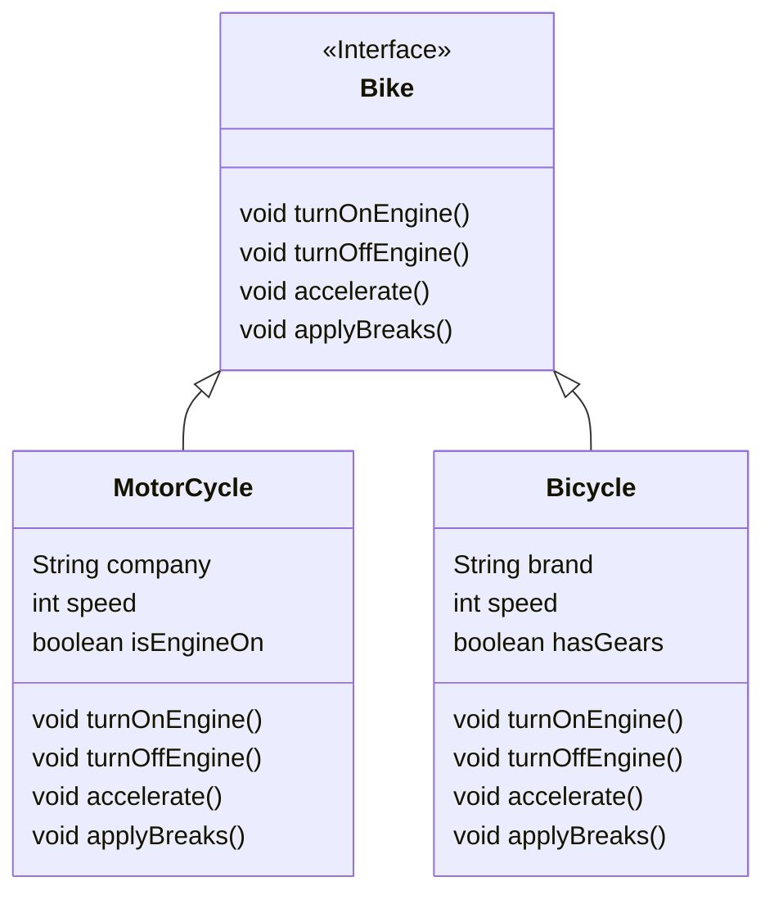

Bike.java

```java
// BAD: This design violates LSP
public interface Bike {
    void turnOnEngine();
    void turnOffEngine();
    void accelerate();
    void applyBrakes();
}
```

MotorCycle.java

```java
// Subclass of Bike - implements all Bike class behavior
public class MotorCycle implements Bike {
    String company;
    boolean isEngineOn;
    int speed;

    public MotorCycle(String company, int speed) {
        this.company = company;
        this.speed = speed;
    }

    @Override
    public void turnOnEngine() {
        this.isEngineOn = true; // turn on the engine!
        System.out.println("Engine is ON!");
    }

    @Override
    public void turnOffEngine() {
        this.isEngineOn = false; // turn off the engine!
        System.out.println("Engine is OFF!");
    }

    @Override
    public void accelerate() {
        this.speed = this.speed + 10; // increase the speed
        System.out.println("MotorCycle Speed: " + this.speed);
    }

    @Override
    public void applyBrakes() {
        this.speed = this.speed - 5; // decrease the speed
        System.out.println("MotorCycle Speed: " + this.speed);
    }
}
```

Bicycle.java

```java
// This class violates LSP!
public class Bicycle implements Bike {
    String brand;
    Boolean hasGears;
    int speed;

    public Bicycle(String brand, Boolean hasGears, int speed) {
        this.brand = brand;
        this.hasGears = hasGears;
        this.speed = speed;
    }

    // LSP Violation: Strengthening preconditions
    // Bicycle changes the behavior of turnOnEngine
    @Override
    public void turnOnEngine() {
        throw new AssertionError("Detail Message: Bicycle has no engine!");
    }

    // Bicycle changes the behavior of turnOffEngine
    @Override
    public void turnOffEngine() {
        throw new AssertionError("Detail Message: Bicycle has no engine!");
    }

    @Override
    public void accelerate() {
        this.speed = this.speed + 10; // increase the speed
        System.out.println("Bicycle Speed: " + this.speed);
    }

    @Override
    public void applyBrakes() {
        this.speed = this.speed - 5; // decrease the speed
        System.out.println("Bicycle Speed: " + this.speed);
    }

}
```

```java
// Usage example - demonstrates the LSP violations
public class Demo {
    public static void main(String[] args) {
        // create the objects
        MotorCycle motorCycle = new MotorCycle("HeroHonda", 10);
        Bicycle bicycle = new Bicycle("Hercules", true, 10);

        // use the objects
        // Works fine with MotorCycle - implements all Bike class behavior
        motorCycle.turnOnEngine();
        motorCycle.accelerate();
        motorCycle.applyBrakes();
        motorCycle.turnOffEngine();
        // Client expects to be able to see the same behavior with Bicycle
        bicycle.turnOnEngine(); // fails to implement Bike class behavior
        bicycle.accelerate();
        bicycle.applyBrakes();
        bicycle.turnOffEngine(); // fails to implement Bike class behavior
    }
}
```

**Example 2**

```java
// Usage example - Violation of Liskov Substitution
public class ViolationDemo {
    public static void main(String[] args) {
        // Happy Flow
        List<Vehicle> vehicleList = new ArrayList<>();
        vehicleList.add(new MotorCycle());
        vehicleList.add(new Car());
        for (Vehicle vehicle : vehicleList) {
            System.out.println(vehicle.hasEngine().toString());
        }
        // Add Bicycle - Violation of LSP
        List<Vehicle> vehicleList2 = new ArrayList<>();
        vehicleList2.add(new MotorCycle());
        vehicleList2.add(new Car());
        vehicleList2.add(new Bicycle());
        for (Vehicle vehicle : vehicleList2) {
            System.out.println(vehicle.hasEngine().toString()); // throws NPE
            // Client code will break for Bicycle
        }
    }
}
```

### Solution

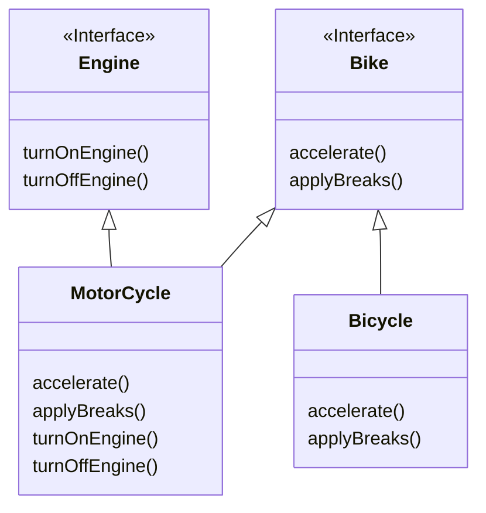

## Interface Segregation Principle

> Interface should be such that client should not implement unnecessary function that they do not need

### Violation

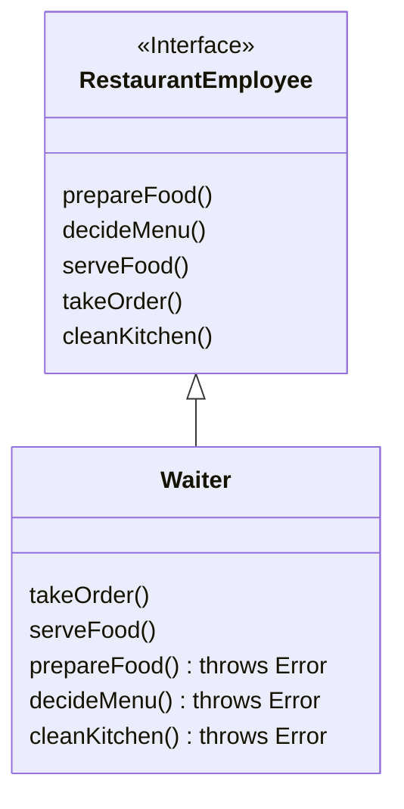

[RestaurantEmployee.java](./src/main/java/com/rk/video1solid/interfacesegregation/violation/RestaurantEmployee.java)

```java
package com.rk.video1solid.interfacesegregation.violation;

// BAD: This class violates ISP
// This is a fat interface
// One large interface forcing all implementers to define unused methods
public interface RestaurantEmployee {

    void prepareFood();

    void decideMenu();

    void serveFoodAndDrinks();

    void takeOrder();

    void cleanTheKitchen();
}
```

[Waiter.java](./src/main/java/com/rk/video1solid/interfacesegregation/violation/Waiter.java)

```java
// BAD: This class violates ISP(clients shouldn't depend on unused interfaces)
// Bloated class with empty or error-throwing methods
// This Waiter is forced to implement methods it doesn't need
public class Waiter implements RestaurantEmployee {
    @Override
    public void takeOrder() {
        System.out.println("Taking order...");
    }

    @Override
    public void serveFoodAndDrinks() {
        System.out.println("Serving food and drinks...");
    }

    @Override
    public void cleanTheKitchen() {
        // Forced to implement but doesn't make sense for a waiter
        throw new AssertionError("Detail Message: Waiter cannot clean the kitchen!");
    }

    @Override
    public void prepareFood() {
        // Forced to implement but doesn't make sense for a waiter
        throw new AssertionError("Detail Message: Waiter cannot prepare food!");
    }

    @Override
    public void decideMenu() {
        // Forced to implement but doesn't make sense for a waiter
        throw new AssertionError("Detail Message: Waiter cannot decide the menu!");
    }
}
```

- Here Waiter unnecessarly implements functions that it does not need

### Solution

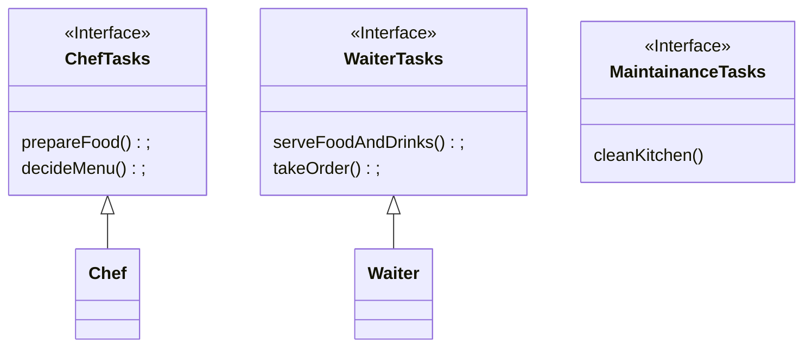

**Benefits**

- Each class implements features it needs
- No forced implementation
- cleaner code

## Dependency Injection Principle

> High Level component should not depend on Low level component, instead they should depend on abstraction

Lets say we have these utilities

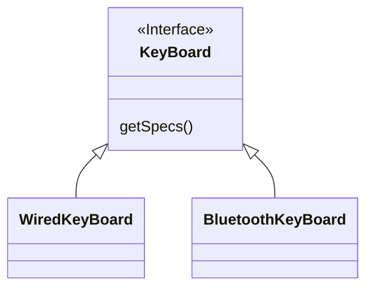

[KeyBoard.java](./src/main/java/com/rk/video1solid/dependencyinversion/utility/Keyboard.java)

```java
public interface Keyboard {
    void getSpecifications();
}
```

[WiredKeyBoard.java](./src/main/java/com/rk/video1solid/dependencyinversion/utility/WiredKeyboard.java)

```java
// Low-level module - concrete implementation
public class WiredKeyboard implements Keyboard {
    private final String connectionType;
    private final String company;
    private final String modelVersion;
    private final String color;

    public WiredKeyboard(String connectionType, String company, String modelVersion, String color) {
        this.connectionType = connectionType;
        this.company = company;
        this.modelVersion = modelVersion;
        this.color = color;
    }

    public void getSpecifications() {
        System.out.println("===> Wired Keyboard");
        System.out.println("Connection Type: " + connectionType);
        System.out.println("Company: " + company);
        System.out.println("Model Version: " + modelVersion);
        System.out.println("Color: " + color);
    }
}
```

[BluetoothKeyBoard.java](./src/main/java/com/rk/video1solid/dependencyinversion/utility/BluetoothKeyboard.java)

```java
// Low-level module - concrete implementation
public class BluetoothKeyboard implements Keyboard {
    private final String connectionType;
    private final String company;
    private final String modelVersion;
    private final String color;

    public BluetoothKeyboard(String connectionType, String company, String modelVersion, String color) {
        this.connectionType = connectionType;
        this.company = company;
        this.modelVersion = modelVersion;
        this.color = color;
    }

    public void getSpecifications() {
        System.out.println("===> Bluetooth Keyboard");
        System.out.println("Connection Type: " + connectionType);
        System.out.println("Company: " + company);
        System.out.println("Model Version: " + modelVersion);
        System.out.println("Color: " + color);
    }
}
```

### Violation

[MacBook.java](./src/main/java/com/rk/video1solid/dependencyinversion/violation/MacBook.java)

```java
// VIOLATION OF DIP
// High-level module directly depending on low-level module
public class MacBook {
    private final WiredKeyboard keyboard;
    private final WiredMouse mouse;

    // Direct dependency on concrete class
    public MacBook(WiredKeyboard wiredKeyboard, WiredMouse wiredMouse) {
        keyboard = wiredKeyboard; // Tight coupling
        mouse = wiredMouse; // Tight coupling
    }

    public Mouse getMouse() {
        return mouse;
    }

    public Keyboard getKeyboard() {
        return keyboard;
    }
}
```

### Solution

[MacBook.java](./src/main/java/com/rk/video1solid/dependencyinversion/solution/MacBook.java)

```java
package com.rk.video1solid.dependencyinversion.solution;

import com.rk.video1solid.dependencyinversion.utility.Keyboard;
import com.rk.video1solid.dependencyinversion.utility.Mouse;

// Following DIP
// High-level module uses abstraction
public class MacBook {
    private final Keyboard keyboard;
    private final Mouse mouse;

    // Abstraction - defines contract
    // Dependency injection through constructor
    public MacBook(Mouse mouse, Keyboard keyboard) {
        this.keyboard = keyboard; // Works with any kind of keyboard and mouse
        this.mouse = mouse;
    }

    public Mouse getMouse() {
        return mouse;
    }

    public Keyboard getKeyboard() {
        return keyboard;
    }
}
```

# Strategy Pattern

## Basic UML

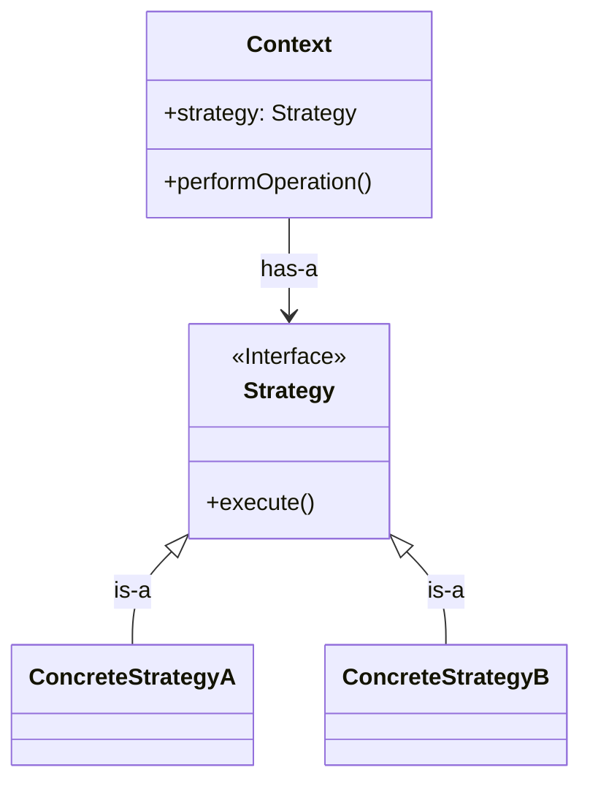

## Problem

[Vehicle.java](./src/main/java/com/rk/behavioralpatterns/strategy/vehicledrivemodes/problem/Vehicle.java)

```java
public class Vehicle {

    public void drive() {
        System.out.print("\n" + this.getClass().getSimpleName() + ": ");
        System.out.println("Driving Capability: Normal");
    }
}
```

[OffRoadVehicle.java](./src/main/java/com/rk/behavioralpatterns/strategy/vehicledrivemodes/problem/OffRoadVehicle.java)

```java
public class OffRoadVehicle extends Vehicle {

    // Overriding the drive method to provide specific behavior
    public void drive() {
        System.out.print("\n" + this.getClass().getSimpleName() + ": ");
        System.out.println("Driving Capability: Sports"); // code duplication
        // As sports drive mode is not available in the parent class, we need to
        // override it and implement
        // the specific behavior for all new vehicle types that require sports drive
        // mode
    }

}
```

[SportsVehicle.java](./src/main/java/com/rk/behavioralpatterns/strategy/vehicledrivemodes/problem/SportsVehicle.java)

```java
public class SportsVehicle extends Vehicle {

    // Overriding the drive method to provide specific behavior for sports vehicles
    public void drive() {
        System.out.print("\n" + this.getClass().getSimpleName() + ": ");
        System.out.println("Driving Capability: Sports");
    }
}
```

[PassengerVehicle.java](./src/main/java/com/rk/behavioralpatterns/strategy/vehicledrivemodes/problem/PassengerVehicle.java)

```java
public class PassengerVehicle extends Vehicle {

    // Reusing the existing drive method from the parent class
    // Driving Capability: Normal
    // No new implementation required
}
```

### Issues

- **Code duplication** in OffRoadVehicle and SportsVehicle
- **Tight coupling** between drive mode and vehicles

## Solution

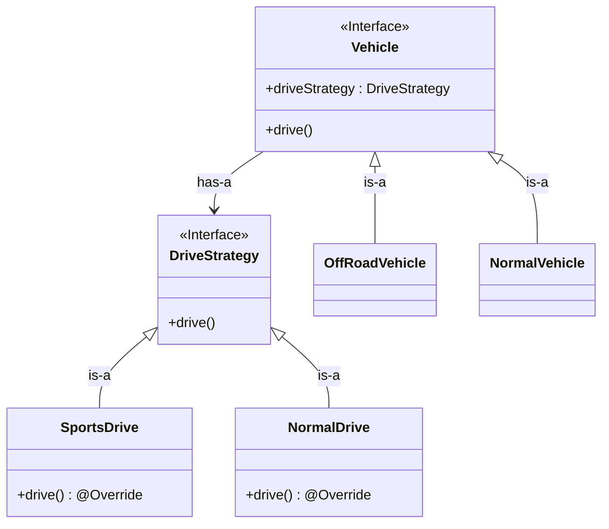

### Context

[Vehicle.java](./src/main/java/com/rk/behavioralpatterns/strategy/vehicledrivemodes/solution/context/Vehicle.java)

```java
// Context class - holds a reference to a strategy object
public class Vehicle {
    DriveStrategy driveStrategy;

    // constructor injection
    public Vehicle(DriveStrategy driveStrategy) {
        this.driveStrategy = driveStrategy;
    }

    public void drive() {
        System.out.print("\n" + this.getClass().getSimpleName() + ": ");
        driveStrategy.drive();
    }
}
```

[SportsVehicle.java](./src/main/java/com/rk/behavioralpatterns/strategy/vehicledrivemodes/solution/context/SportsVehicle.java)

```java
// Concrete context subclass
public class SportsVehicle extends Vehicle {

    public SportsVehicle(DriveStrategy driveStrategy) {
        super(driveStrategy);
    }
}
```

[GoodsVehicle.java](./src/main/java/com/rk/behavioralpatterns/strategy/vehicledrivemodes/solution/context/GoodsVehicle.java)

```java
// Concrete context subclass
public class GoodsVehicle extends Vehicle {

    public GoodsVehicle(DriveStrategy driveStrategy) {
        super(driveStrategy);
    }
}
```

### Strategy

[DriveStrategy.java](./src/main/java/com/rk/behavioralpatterns/strategy/vehicledrivemodes/solution/strategies/DriveStrategy.java)

```java
// Strategy interface - defines the contract for drive behavior
public interface DriveStrategy {
    public void drive();
}
```

[NormalDrive.java](./src/main/java/com/rk/behavioralpatterns/strategy/vehicledrivemodes/solution/strategies/NormalDrive.java)

```java
// Concrete strategy for normal drive mode
public class NormalDrive implements DriveStrategy {
    @Override
    public void drive() {
        System.out.println("Driving Capability: Normal");
    }
}
```

[SportsDrive.java](./src/main/java/com/rk/behavioralpatterns/strategy/vehicledrivemodes/solution/strategies/SportsDrive.java)

```java
// Concrete strategy for sports drive mode
public class SportsDrive implements DriveStrategy {
    @Override
    public void drive() {
        System.out.println("Driving Capability: Sports");
    }
}
```

# Observer Pattern

> Design pattern where an Object(Observable or Publisher) maintains a list of dependents(observers)
>
> And Automatically notifies the when there is a change in it's state

**Real Life applications**

- Weather stations publishes weather updates to multiple devices
- Social Media
- Youtube Subscription
- Stock market trackers

## Models

- **Push:** Observable pushes data
- **Pull:** Observer holds Observer object reference, when it got to know that something is updated. It Pulls data

## Push Model

### UML

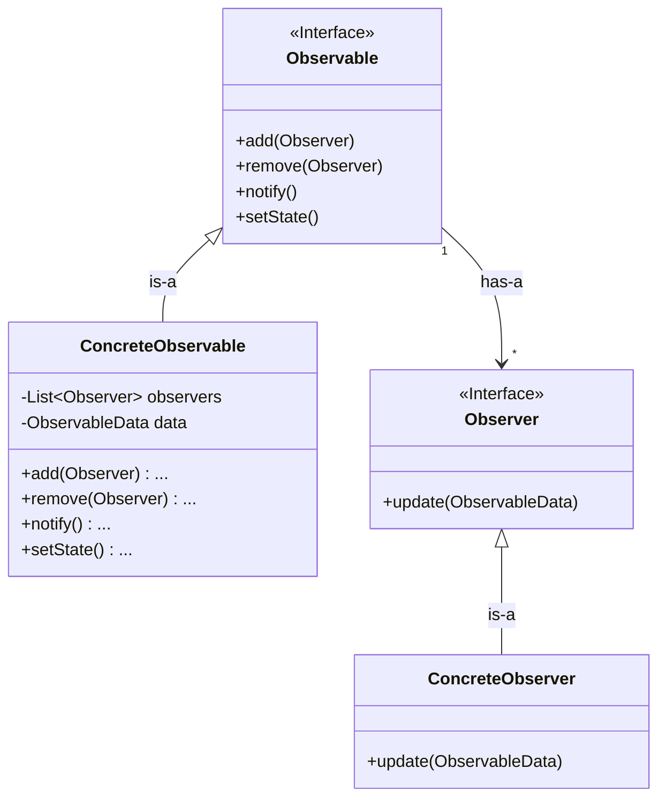

## Pull Model

### UML

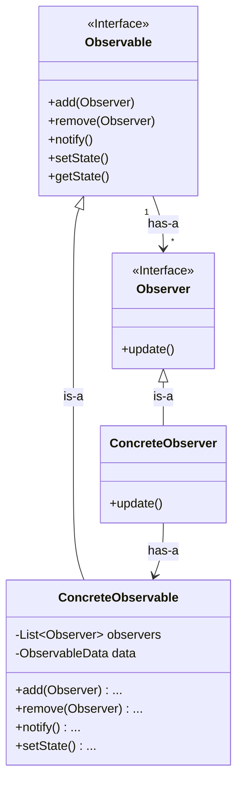

## Example

**Observable**

[WeatherObservable.java](./src/main/java/com/rk/behavioralpatterns/observer/weatherstation/observable/WeatherObservable.java)

```java
// Observable(Subject) interface
// Defines methods for managing observers and notifying them of changes
public interface WeatherObservable {

    void addObserver(WeatherObserver observer);

    void removeObserver(WeatherObserver observer);

    void notifyObservers();

    void setWeatherReadings(float temperature, float humidity, float pressure);
}
```

[WeatherStation.java](./src/main/java/com/rk/behavioralpatterns/observer/weatherstation/observable/WeatherStation.java)

```java
// Concrete Observable (Subject)
// WeatherStation - the concrete observable class that holds weather data
public class WeatherStation implements WeatherObservable {
    // List of observers registered for updates
    private final List<WeatherObserver> observers;
    // Observable Data
    private float temperature;
    private float humidity;
    private float pressure;

    public WeatherStation() {
        observers = new ArrayList<>();
    }

    @Override
    public void addObserver(WeatherObserver observer) {
        observers.add(observer);
        System.out.println("[+] Observer registered: " + observer.getClass().getSimpleName());
    }

    @Override
    public void removeObserver(WeatherObserver observer) {
        observers.remove(observer);
        System.out.println("[-] Observer removed: " + observer.getClass().getSimpleName());
    }

    @Override
    public void notifyObservers() {
        for (WeatherObserver observer : observers) {
            // Notify each observer about the change in weather data(state)
            observer.update(); // Observer will update its state based on the new data and respond accordingly
        }
    }

    // Method to update weather measurements
    public void setWeatherReadings(float temperature, float humidity, float pressure) {
        this.temperature = temperature;
        this.humidity = humidity;
        this.pressure = pressure;
        notifyObservers();
    }

    // Getters for observers to access weather data
    public float getTemperature() {
        return temperature;
    }

    public float getHumidity() {
        return humidity;
    }

    public float getPressure() {
        return pressure;
    }

    @Override
    public String toString() {
        return "WeatherStation{" +
                "temperature=" + temperature +
                ", humidity=" + humidity +
                ", pressure=" + pressure +
                '}';
    }
}
```

**Observer**

[WeatherObserver](./src/main/java/com/rk/behavioralpatterns/observer/weatherstation/observer/WeatherObserver.java)

```java
// Observer interface - defines the update method
// Concrete observers implement this interface to update their state
// and respond to changes in its OWN way
public interface WeatherObserver {
    void update();
}
```

[CurrentConditionsDisplay](./src/main/java/com/rk/behavioralpatterns/observer/weatherstation/observer/CurrentConditionsDisplay.java)

```java
// Concrete Observer 1 - Current Conditions Display (on TV or Mobile)
public class CurrentConditionsDisplay implements WeatherObserver {
    private final WeatherObservable weatherStation;

    public CurrentConditionsDisplay(WeatherObservable weatherStation) {
        this.weatherStation = weatherStation;
        weatherStation.addObserver(this);
    }

    // CurrentConditionsDisplay implements the update method in its own way
    @Override
    public void update() {
        System.out.println("Saving weather data... ");
        display();
    }

    // Display the current weather conditions
    public void display() {
        System.out.println("Current Weather Conditions: " + weatherStation.toString());
    }
}
```

## Points to remember

- In Push model, Observable passes the data explicitly. where as in pull model, Observable just notifies and the Observers will fetch the data.
